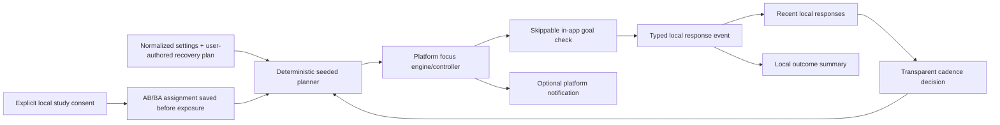

# Architecture

## Boundaries

- `packages/focus_core` owns normalized settings, schema migration, session/event models, cue planning, adaptive decisions, opt-in study enrollment/assignment, local outcome calculations, measurement quality checks, and privacy-preserving research export. It has no Flutter or platform dependency.
- `apps/ios` owns Cupertino/Material presentation, shared-preferences persistence, haptics, and iOS local-notification scheduling.
- `apps/windows` owns desktop presentation, file persistence, tray behavior, and the native method-channel adapter for Windows notifications.

Both apps re-export the shared model/planner APIs temporarily to keep existing imports stable. New domain behavior belongs in `focus_core`; platform packages should not fork the algorithm.

## State flow

## Data compatibility

Schema version `5` retains schema-4 algorithm/settings snapshots, planned prompt offsets, prompt correlation IDs, response latency, and optional post-session outcomes while adding explicit study enrollment and per-session assignment. It preserves earlier fields, legacy platform notification keys, and typed migration of old `microbreak_start`/`microbreak_end` strings. Fresh defaults change, but stored user choices are normalized and retained.

## Failure policy

- Invalid settings fall back to safe normalized defaults.
- Individually corrupt session records are skipped rather than blocking all history.
- Optional notification/tray adapter failures must not stop the timer.
- Windows JSON writes use a same-directory temporary file, flush, backup/replace, restoration on failure, and cleanup. Reads fall back to a valid backup and skip individually corrupt session entries.
- Planner output is bounded, deterministic under a seed, and limited to eight checks per session.
- An active study assignment is persisted before planning/exposure. Persistence failure aborts session start; control-arm exposure, post-start assignment, and duplicate assignments are critical measurement errors.
